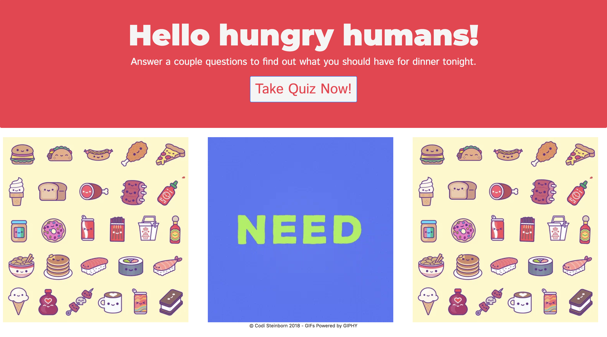
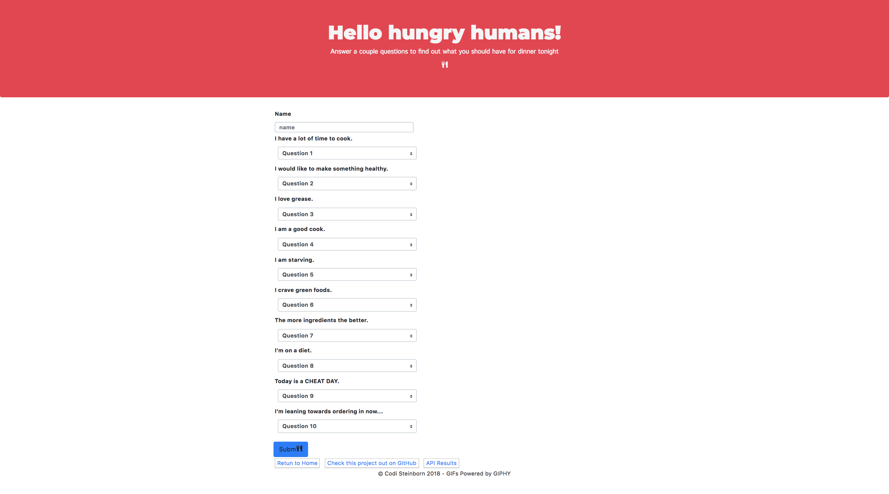
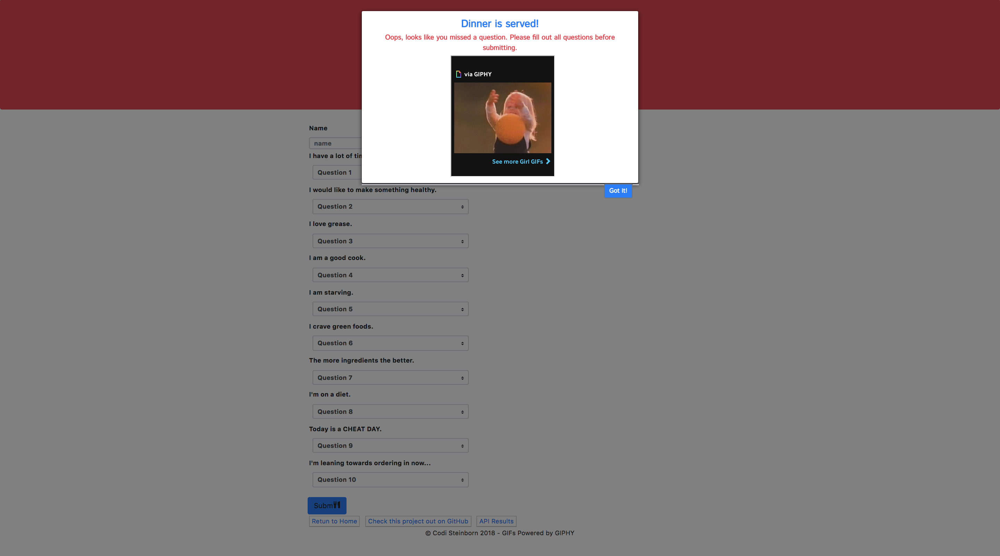

# BuzzFood

<https://codisteinborn.github.io/BuzzFood/> \
Version 1.0 \
Original Deployment Date - February 23, 2018

# The Idea:

I wanted to replicate a BuzzFeed-like quiz for users to fill out and get matched with an answer based on his/her responses. When thinking of a theme for this project, I decided to stick with what I know and love- FOOD. So in this application users answer a series of 10 questions and get matched with a food they they should make for dinner.

# Users Guide:

Application Link - <https://codisteinborn.github.io/BuzzFood/>

Instructions -
Upon opening the application, you will be brought to the Home Page. Here you will click on the "Take Quiz Now!" button and be directed to the Quiz Page.

Now that you are on the Quiz Page, you will fill out the form by first entering your name and then answering all 10 of the survey questions by rating them on a scale of 1(Strongly Disagree) to 5(Strongly Agree). Finally, click the"Submit" button to see your results.

Once you have submitted your results, you will see a modal appear with what you should have for dinner! If you have missed any of the questions in the survey, you will receive a notification to go back and finish answering all of the questions before submitting again.

# Built Utilizing:

Bootstrap v3.3.7 - <http://getbootstrap.com/docs/3.3/> \
Bootstrap v4 - <http://getbootstrap.com/docs/4.0/> \
jQuery 3.3.1 - <https://code.jquery.com/> \
Google Fonts - <https://fonts.google.com/> \

# Original Contributors:

Codi Steinborn  - <https://github.com/codisteinborn/> \

# Ideas for Improvement/Future Development:

Have an idea for improving this site? Please first discuss the change you wish to make via email with the owner of this repository. Email address can be found on the contributor's gitHub pages (link above).
